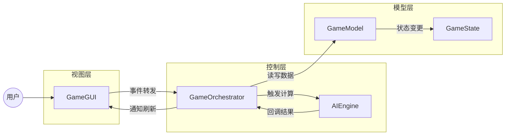
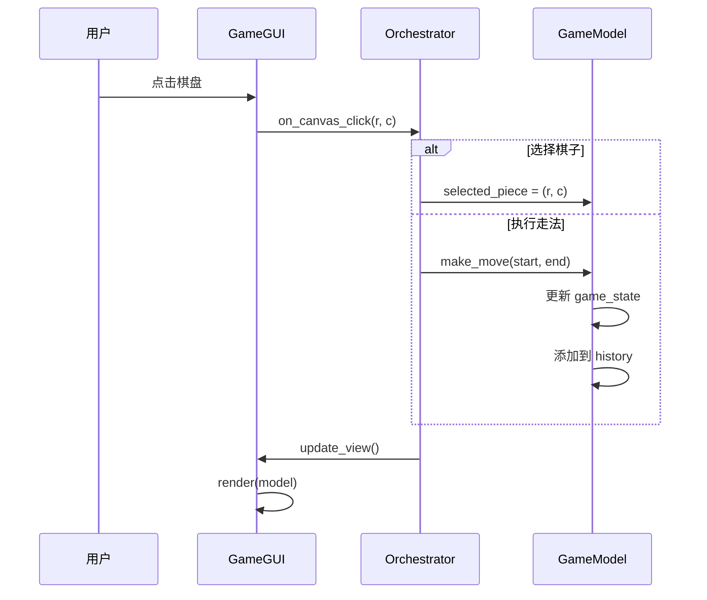
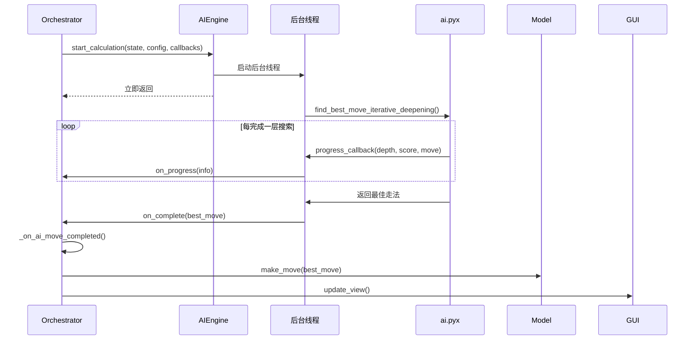

# 三炮十五兵 AI版 - 架构设计

本文档详细说明项目的架构设计、设计决策和核心数据流。

## 架构概述

项目采用 **MVC 变体架构**，实现了清晰的职责分离：

---

## 核心设计哲学

| 原则 | 说明 | 应用 |
|:---|:---|:---|
| **单一职责 (SRP)** | 每个类只做一件事 | `AIEngine` 只负责 AI 计算 |
| **松耦合** | 模块间通过接口通信 | 组件通过回调函数交互 |
| **数据驱动** | 单一事实来源 | `GameModel` 是唯一数据源 |
| **异步设计** | 耗时操作不阻塞 UI | AI 计算在后台线程进行 |
| **单向数据流** | Model → Controller → View | 禁止 View 直接修改 Model |

---

## 分层职责

### 视图层 (View)

**文件**: `gui.py`, `settings_dialog.py`

**职责**:
- 根据 Model 数据渲染 UI
- 将用户输入事件**无逻辑地**转发给 Orchestrator
- 不包含任何业务逻辑

**关键特性**:
- "哑巴"视图：只负责显示和转发
- 通过 `bind_event_handlers()` 接收事件处理器
- 通过 `render(model)` 刷新界面

### 控制层 (Controller)

**文件**: `orchestrator.py`, `ai_engine.py`

#### GameOrchestrator

应用的"大脑"，负责：
- 接收 View 的事件
- 调用 Model 更新数据
- 调用 AIEngine 进行计算
- 通知 View 刷新

#### AIEngine

AI 计算管理器，负责：
- 异步执行 AI 搜索
- 通过回调返回结果和进度
- 响应停止请求

### 模型层 (Model)

**文件**: `game_model.py`, `game_config.py`

**职责**:
- 维护游戏数据
- 执行走法
- 管理历史记录
- 检测和棋

**关键特性**:
- 完全独立，对 UI 和 AI 无感知
- 任何状态修改都必须通过 Model

---

## 核心数据流

### 用户走子流程

### AI 计算流程

---

## 设计决策记录

### 1. 为什么使用回调而非事件总线？

**决策**: 使用回调函数进行组件间通信

**原因**:
- 项目规模适中，回调足够简洁
- 类型明确，IDE 支持好
- 避免引入额外依赖

### 2. 为什么 GameState 是不可变的？

**决策**: `GameState.board` 使用 `tuple` 而非 `list`

**原因**:
- 支持 Zobrist 哈希缓存
- 便于历史记录管理
- 避免意外修改

### 3. 为什么 AI 计算在单独线程？

**决策**: `AIEngine._worker` 在 `daemon` 线程中运行

**原因**:
- 保持 UI 响应
- 支持随时停止计算
- 避免阻塞主事件循环

---

## 相关文档

- [模块概览](REF_modules_overview.md) - 模块列表和依赖
- [API 接口](REF_api_interfaces.md) - 详细接口说明
- [快速入门](GUIDE_getting_started.md) - 使用指南
