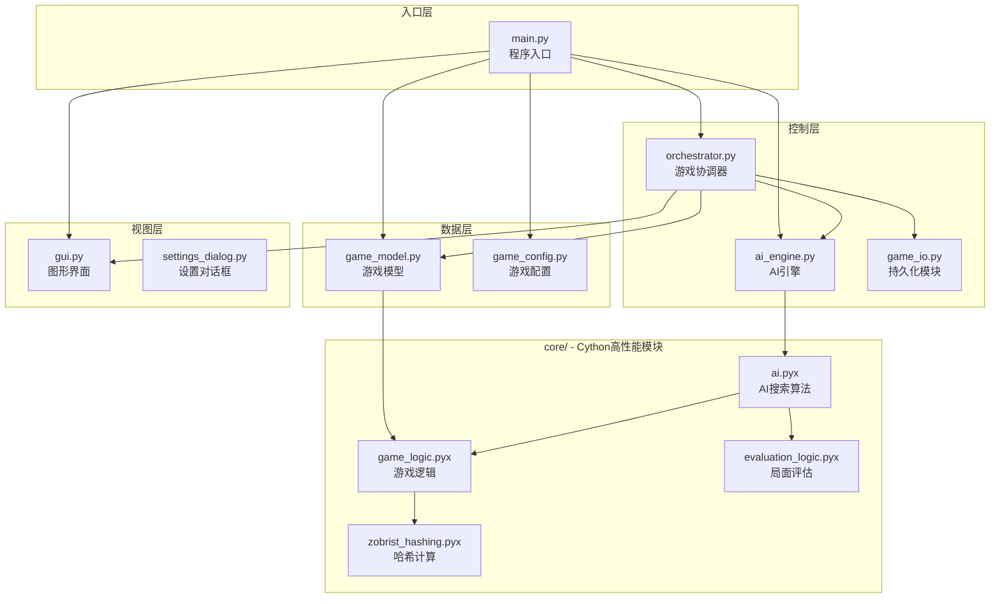

# 三炮十五兵 AI版 - 模块概览

本文档介绍项目各模块的职责、依赖关系和核心接口。

## 模块依赖关系



---

## 模块详细说明

### 入口层

| 模块 | 文件 | 职责 |
|:---|:---|:---|
| **程序入口** | `main.py` | 初始化所有核心组件，启动GUI事件循环 |

### 控制层

| 模块 | 文件 | 职责 |
|:---|:---|:---|
| **游戏协调器** | `orchestrator.py` | 应用的"大脑"，处理用户事件，协调模型与视图 |
| **AI引擎** | `ai_engine.py` | 管理AI异步计算，提供启动/停止接口 |
| **持久化模块** | `game_io.py` | 棋谱的保存与加载 |

### 数据层

| 模块 | 文件 | 职责 |
|:---|:---|:---|
| **游戏模型** | `game_model.py` | 管理游戏状态、历史记录、复盘状态 |
| **游戏配置** | `game_config.py` | 存储游戏设置（对战模式、AI难度等） |

### 视图层

| 模块 | 文件 | 职责 |
|:---|:---|:---|
| **图形界面** | `gui.py` | Tkinter实现的游戏界面渲染 |
| **设置对话框** | `settings_dialog.py` | 游戏设置弹窗 |

### 核心算法层 (Cython)

| 模块 | 文件 | 职责 |
|:---|:---|:---|
| **游戏逻辑** | `core/game_logic.pyx` | `GameState` 类，走法生成，胜负判断 |
| **AI搜索** | `core/ai.pyx` | Alpha-Beta 搜索、PVS、静默搜索 |
| **局面评估** | `core/evaluation_logic.pyx` | 棋盘评估函数，控制区域计算 |
| **哈希计算** | `core/zobrist_hashing.pyx` | Zobrist 哈希，用于置换表 |

---

## 核心类速查

### GameState (`core/game_logic.pyx`)

游戏局面的不可变表示。

```python
class GameState:
    board: tuple[tuple[int, ...], ...]  # 5×5 棋盘
    current_player: int                  # 当前行动方 (CANNON=2, SOLDIER=1)
    winner: int | None                   # 胜方 (None=未结束)
    soldier_count: int                   # 剩余兵数
    hash: int                            # Zobrist 哈希值
    
    def get_valid_moves(self, r, c) -> list[tuple]  # 获取合法走法
    def move_piece(self, sr, sc, er, ec) -> GameState  # 执行走法
```

### GameModel (`game_model.py`)

游戏数据管理器，是唯一的"事实来源"。

```python
class GameModel:
    game_state: GameState       # 当前局面
    move_history: list          # 历史记录
    is_replay_mode: bool        # 复盘模式标记
    
    def reset(self)                      # 重置游戏
    def make_move(self, start, end)      # 执行走法
    def load_state_from_history(self, i) # 加载历史局面
```

### AIEngine (`ai_engine.py`)

异步AI计算管理器。

```python
class AIEngine:
    def is_calculating(self) -> bool           # 是否正在计算
    def start_calculation(self, state, config, on_complete, on_progress)
    def stop_calculation(self)                 # 停止计算
```

### GameOrchestrator (`orchestrator.py`)

事件协调器，连接模型、视图和AI。

```python
class GameOrchestrator:
    def on_canvas_click(self, r, c)      # 处理棋盘点击
    def on_calculate_move(self)          # 触发AI计算
    def on_new_game(self)                # 新游戏
    def check_for_ai_turn(self)          # 检查AI回合
```

---

## 数据流向

```
用户点击 → GUI → Orchestrator → Model → GameState
                      ↓
                   AI Engine → ai.pyx → 最佳走法
                      ↓
                   Orchestrator → Model → GUI 刷新
```

---

## 相关文档

- [架构设计](REF_architecture.md) - 详细的架构说明
- [API 接口](REF_api_interfaces.md) - 完整的接口文档
- [快速入门](GUIDE_getting_started.md) - 运行和使用指南
