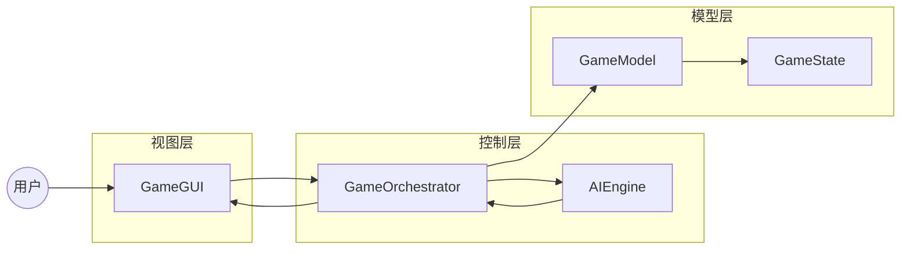
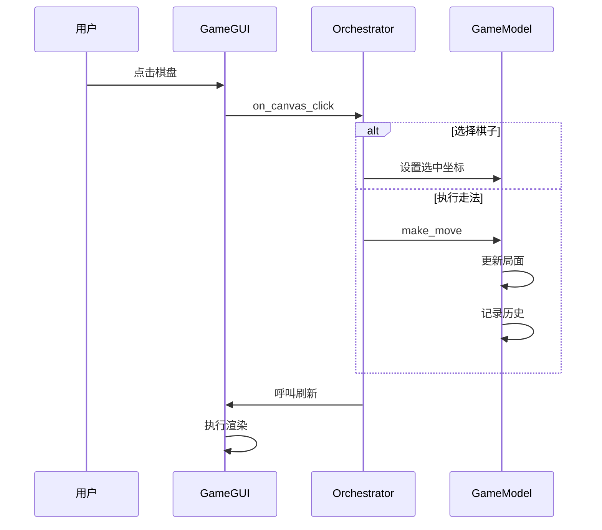
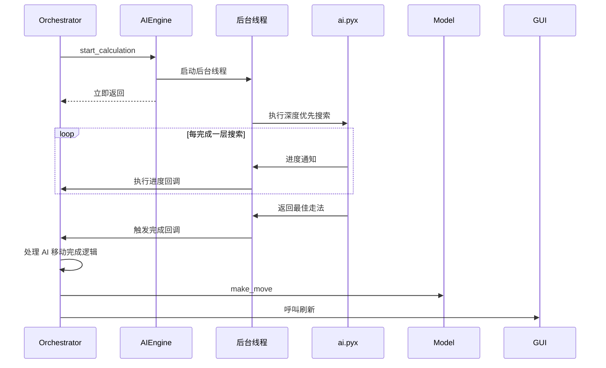

# 三炮十五兵 AI版：架构设计

本文档详细说明项目的架构设计、设计决策和核心数据流。

## 架构概述

项目采用 MVC 衍生架构，实现职责分离。

---

## 核心设计哲学

| 原则 | 说明 | 应用 |
| :--- | :--- | :--- |
| 单一职责 | 类仅承担单一职能 | AIEngine 仅负责 AI 计算 |
| 松耦合 | 模块间通过接口通信 | 组件通过回调函数交互 |
| 数据驱动 | 技术溯源基准 | GameModel 是唯一数据源 |
| 异步设计 | 耗时操作不阻塞界面线程 | AI 计算在后台线程进行 |
| 单向数据流 | 按模型、控制器、视图顺序流动 | 视图对模型层仅具只读权限 |

---

## 分层职责

### 视图层：src/view/

相关文件：main_window.py，dialogs.py。

职责：
- 根据模型层数据渲染界面。
- 捕获用户鼠标或键盘事件并转发给调度器。

核心机制：
- 哑视图性质：不包含业务判断，不保存对局数据。
- 依赖于顶层调用刷新函数被动更新。

### 控制层：src/controller/ 与 src/ai/

相关文件：orchestrator.py，engine.py。

#### GameOrchestrator
模型视图控制器的中枢路由，负责：
- 接收视图层派发的原始事件。
- 校准和验证状态后写入模型。
- 根据模式切换调度算法或阻断操作。
- 状态变更后呼叫视图刷新。

#### AIEngine
独立守护线程隔离管理器，负责：
- 在不阻塞界面主循环的前提下发起底层搜索求解。
- 使用停止事件中断搜索树。
- 通过线程安全的回调函数将搜索进度通知给主视图。

### 模型层：src/model/

相关文件：game_model.py，config.py。

职责：
- game_model.py：作为技术溯源基准，持有对局生命周期数据，包含历史记录集合与选中状态。
- config.py：维护当前游戏全局设置，包括对战阵营、搜索深度阈值。

边界判定：
- 棋盘数据的变更操作必须经由模型层发出。模型层对外界的视图及算法行为机制零感知。

### 底层算法层：core/
核心组件：game_logic.pyx 负责状态机与校验；search_manager.pyx 负责调度；engine.pyx 负责递归内核；search_infrastructure.pyx 负责置换表架构。
此层采取零分配设计。向其推入局面数据时会被转换为 C 数组。此层脱离模型视图控制器，作为高算力模块。

关键特性：
- 环境隔离：算法内核对界面及线程调度细节零感知。
- 状态闭环：棋盘状态的合法变更逻辑强制收束于模型层。

---

## 核心数据流

### 用户走子流程

### AI 计算流程

---

## 参考文献与接口阅读指引

- [设计决策记录](REF_ARCH_design_decisions.md)：涵盖组件通信、不可变性及并行调度的核心决策依据。
- [API 交互契约](REF_INTERFACE_api_interfaces.md)：涵盖跨层调用的详细方法签名、参数约束及生命周期管理。
- [极速优化档案](REF_ALGO_zero_allocation.md)：查阅底层的零分配硬性约束。
