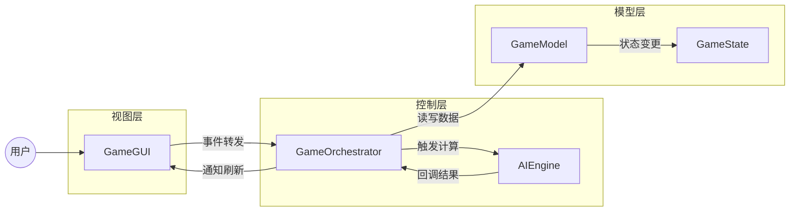
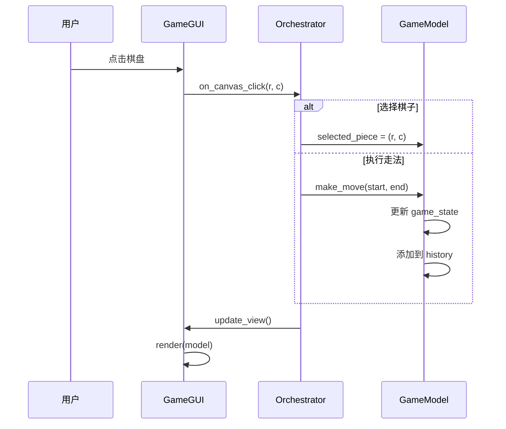
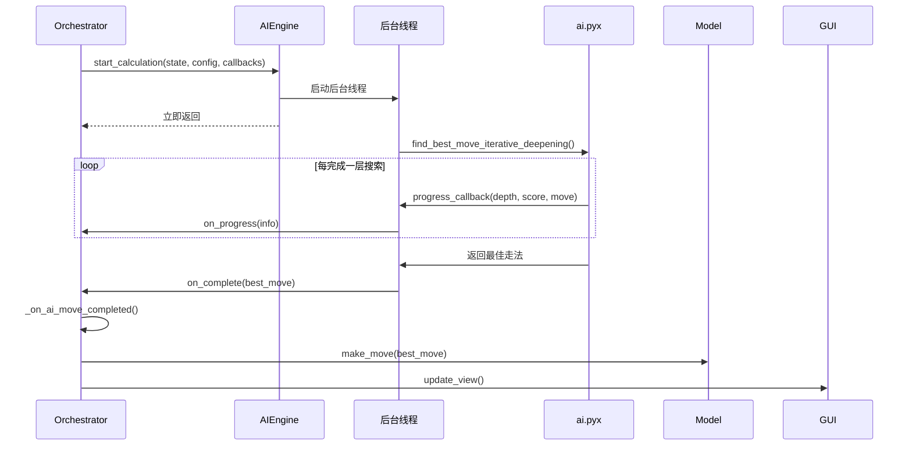

# 三炮十五兵 AI版 - 架构设计

本文档详细说明项目的架构设计、设计决策和核心数据流。

## 架构概述

项目采用 **MVC 变体架构**，实现了清晰的职责分离：

---

## 核心设计哲学

| 原则               | 说明                      | 应用                      |
| :----------------- | :------------------------ | :------------------------ |
| **单一职责 (SRP)** | 每个类只做一件事          | `AIEngine` 只负责 AI 计算 |
| **松耦合**         | 模块间通过接口通信        | 组件通过回调函数交互      |
| **数据驱动**       | 单一事实来源              | `GameModel` 是唯一数据源  |
| **异步设计**       | 耗时操作不阻塞 UI         | AI 计算在后台线程进行     |
| **单向数据流**     | Model → Controller → View | 禁止 View 直接修改 Model  |

---

## 分层职责

### 视图层 (View: `src/view/`)

**文件**: `main_window.py`, `dialogs.py` (原 `gui.py`, `settings_dialog.py`)

**职责**:
- 根据 Model 数据渲染 UI 界面。
- 捕获用户鼠标/键盘事件并**无逻辑地**转发给 Orchestrator。

**核心机制**:
- 绝对的"哑巴"视图：不包含任何业务判断，不保存任何对局数据。
- 依赖于顶层调用 `render(model)` 被动刷新。

### 控制层 (Controller: `src/controller/` & `src/ai/`)

**文件**: `orchestrator.py`, `engine.py` (AI)

#### GameOrchestrator
整个 MVC 的中枢路由，负责：
- 接收 View 派发的生事件。
- 调校和验证状态后，写入 GameModel。
- 根据模式切换（人机配置）调度 AI 或阻断操作。
- 状态落地后主动呼叫 View 刷新。

#### AIEngine (`engine.py`)
独立守护线程隔离管理器，负责：
- 在不阻塞 GUI (`main_loop`) 的前提下发起底层 Cython 搜索求解。
- 使用 `stop_event` 中断搜索树。
- 通过 Thread-safe 的 Callbacks 将每层搜索进度通知给主视图。

### 模型层 (Model: `src/model/`)

**文件**: `game_model.py`, `config.py`

**职责**:
- `game_model.py`: 充当“唯一数据来源”(Single Source of Truth)，持有一局游戏的生命周期大局，包含历史记录集合、选中状态。
- `config.py`: 维护当前游戏全局设置（对战阵营、黑白名单、搜索深度阀值）。

**边界判定**:
- 任何人、任何模块对棋盘的篡改必须经由 `GameModel` 发出。且其对外界的 UI 及 AI 行为机制零感知。

### 底层算法层 (Core: `core/*.pyx`)
**核心组件**: `game_logic.pyx`(状态机与校验), `ai.pyx`(博弈树), `evaluation_logic.pyx` (启发评估)
此层采取 Extreme C 化设计（Zero-Allocation）。在每次向其推入 `GameState` 数据时即被降维打散为 C 数组。它脱离 MVC 之上，仅为高算力的黑盒。

**关键特性**:
- 完全独立，对 UI 和 AI 无感知
- 任何状态修改都必须通过 Model

---

## 核心数据流

### 用户走子流程

### AI 计算流程

---

## 设计决策记录

### 1. 为什么使用回调而非事件总线？

**决策**: 使用回调函数进行组件间通信

**原因**:
- 项目规模适中，回调足够简洁
- 类型明确，IDE 支持好
- 避免引入额外依赖

### 2. 为什么 GameState 是不可变的？

**决策**: `GameState.board` 使用 `tuple` 而非 `list`

**原因**:
- 支持 Zobrist 哈希缓存
- 便于历史记录管理
- 避免意外修改

### 3. 为什么 AI 计算在单独线程？

**决策**: `AIEngine._worker` 在 `daemon` 线程中运行

**原因**:
- 保持 UI 响应
- 支持随时停止计算
- 避免阻塞主事件循环

---

## 参考文献与接口阅读指引

- **[API 交互契约](REF_api_interfaces.md)**: 对于新接手开发工作或外部调用的 Agent，请重点查阅此表。它涵盖了上述所有跨层调用的详细方法签名、入参出参与生命周期管理示例。
- **[极速优化档案](REF_Zero_Allocation_Optimization.md)**: 若需修改 `core/` 下的 C 源码，请先查阅底层的零分配硬性约束。
